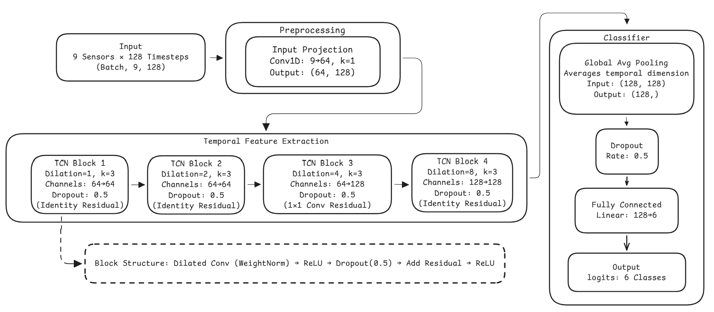
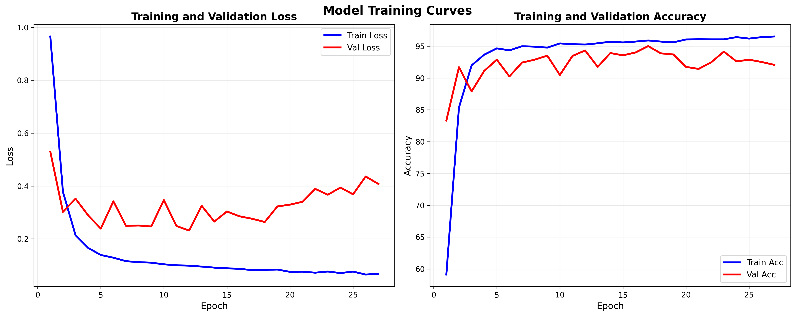

# Temporal Convolutional Network for Human Activity Recognition

A PyTorch implementation of a Temporal Convolutional Network (TCN) for classifying human activities using smartphone sensor data from the UCI HAR Dataset.

## Overview

This project implements a deep learning model that recognizes six different human activities (walking, walking upstairs, walking downstairs, sitting, standing, laying) from accelerometer and gyroscope sensor data. The model uses dilated causal convolutions to capture temporal patterns in the sensor readings.

## Dataset

The model uses the **UCI Human Activity Recognition (HAR) Dataset**, which contains:
- 9 sensor channels (body acceleration x/y/z, body gyroscope x/y/z, total acceleration x/y/z)
- 6 activity classes
- Time series data from 30 subjects performing activities of daily living
- 128 timesteps per sample

The dataset is automatically downloaded and extracted when you run the training script.

## Model Architecture

The TCN architecture consists of:

1. **Input Projection Layer**: Projects 9 input channels to 64 initial channels
2. **TCN Blocks**: 4 residual blocks with dilations [1, 2, 4, 8]
   - Causal convolutions (ensures no future information leakage)
   - Weight normalization
   - ReLU activation
   - Dropout (0.5)
   - Residual connections
3. **Channel Expansion**: Increases to 128 channels in later blocks
4. **Global Average Pooling**: Aggregates temporal features
5. **Classification Head**: Fully connected layer with dropout (0.5)

**Total Parameters**: ~200K trainable parameters

## Key Features

- **Causal Convolutions**: Ensures predictions only depend on past and current inputs
- **Dilated Convolutions**: Exponentially increases receptive field (dilations: 1, 2, 4, 8)
- **Weight Normalization**: Improves training stability
- **Residual Connections**: Enables deeper networks and gradient flow
- **Regularization**: Dropout, weight decay, and gradient clipping
- **Early Stopping**: Prevents overfitting with patience-based stopping

## Results

## License

This project is open source and available for educational and research purposes.

## References

1. Bai, S., Kolter, J. Z., & Koltun, V. (2018). An empirical evaluation of generic convolutional and recurrent networks for sequence modeling. arXiv preprint arXiv:1803.01271.
2. Anguita, D., Ghio, A., Oneto, L., Parra, X., & Reyes-Ortiz, J. L. (2013). A public domain dataset for human activity recognition using smartphones. In ESANN.